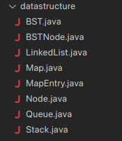

# DaisukeClinic
Small Clinic, BIG Impact.


## About This App
Daisuke Clinic is a **console based data management application** for a small clinic built using Java.

## Features


## Our Team

| **Name**                                                            | **NIM**  | **Task**                                             |
| ------------------------------------------------------------------- | -------- | ---------------------------------------------------- |
| [Muhammad Daffa Rahman](https://github.com/daffarahman)             | L0124062 | Console UI, Navigation, and Data Structure Interface |
| [Naufal Ahmad Fakhriza](https://github.com/sinopalll)               | L0124068 | AppointmentQueue                                     |
| [Phyrurizqi Altiano Firdauzan](https://github.com/Qiwqiw-Alt)       | L0124069 | DoctorLoginList and SearchablePatientTree            |
| [Majeeda Athaya Nashwanaira Ali](https://github.com/nashwanairaath) | L0124104 | PatientRecord and MedicalRecord                      |
| [M. Faza Zulfan Balya](https://github.com/FazeBalya)                | L0124107 |                                                      |

## How To Run?

### Prerequisites
* Java Development Kit (JDK) Version 17 or Higher

#### Unix based OS (macOS, Linux)
1. **Navigate to the Project Directory**:
   ```bash
   cd /path/to/DaisukeClinic
   ```
2. **Compile the project**
   Use the following commands to compile all `.java` files into the `out` directory:
   ```bash
    find src -name "*.java" > sources.txt
    javac -d out @sources.txt
    rm sources.txt
   ```
3. **Run the Project**
   Run the `Main` class from the compiled files in `out` directory:
    ```bash
    java -cp out daisukeclinic.Main
    ```

#### Windows
1. **Navigate to the Project Directory**:
   ```batch
   cd \path\to\DaisukeClinic
   ```
2. **Compile the project**
   Use the following commands to compile all `.java` files into the `out` directory:
   ```batch
    dir /s /b src\*.java > sources.txt
    javac -d out @sources.txt
    del sources.txt
   ```
3. **Run the Project**
   Run the `Main` class from the compiled files in `out` directory:
    ```batch
    java -cp out daisukeclinic.Main
    ```

## Feature Checklist Proof

Feaure checklist from this [docs](https://docs.google.com/document/d/1nFTebiibxVecV4F5Yga1dyzBEQkZEAGwspSo9VjPVrw/edit?tab=t.0#heading=h.bvhel064fgvf)

### Proof that we uses all custom data structures


### Patient Record Management (LinkedList)
* Each patient has: ID, Name, Age, Address, Phone Number.
  
* Create a singly linked list to store patient records.
[Custom Implemented LinkedList.java](src/daisukeclinic/datastructure/LinkedList.java)

[Custom LinkedList implemented in PatientRecord.java](src/daisukeclinic/controller/PatientRecord.java)

* Implement the following:
   * addPatient()

   * removePatientById(int id)

   * findPatientByName(String name)

   * displayAllPatients()

TableUtility.java to display the list as table


### DoctorLoginList (LinkedList)

### AppointmentQueue (Queue)

### SearchablePatientTree (Binary Search Tree)


